# 🍽️ Smart Canteen Ordering System

A scalable full-stack system designed to eliminate long queues in university cafeterias by enabling digital ordering and efficient order management.

---

## 🚀 Overview

This project was built to solve a real, everyday problem: long waiting times and inefficient ordering processes in university cafeterias.

Instead of standing in queues, students and professors can now:

* browse the menu
* place orders in advance
* pick up food at a scheduled time

The system is designed with scalability, performance, and real-world usability in mind.

---

## 🏛️ System Architecture

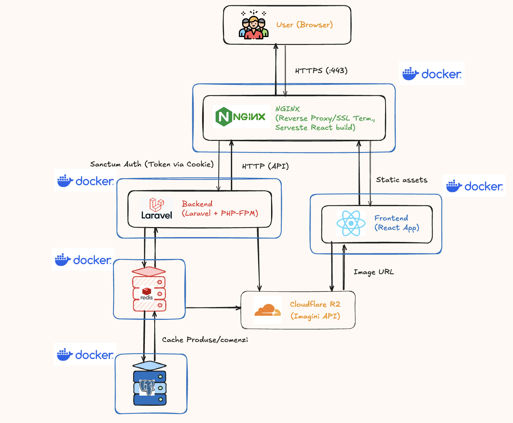

*Microservices-based architecture using Laravel services, Redis for caching, and NGINX as reverse proxy. Kafka integration is planned for asynchronous processing.*

---

## 🏗️ Architecture & Tech Stack

### ⚙️ Core Technologies

* **Frontend:** React
* **Backend:** Laravel (REST API)
* **Database:** PostgreSQL
* **Cache Layer:** Redis
* **Reverse Proxy:** NGINX
* **Storage:** Cloudflare R2
* **Containerization:** Docker & Docker Compose

### 🔄 Scalability & Design

* Decoupled frontend and backend
* Designed for high concurrency environments
* Supports horizontal and vertical scaling
* Optimized using Redis caching
* Ready for event-driven architecture (Kafka planned)

---

## 🔗 Project Structure

This system is split into separate repositories:

### 🔙 Backend (Laravel API)

* https://github.com/val-tri00/project_cantina_backend

### 🎨 Frontend (React)

* https://github.com/val-tri00/project_cantina_frontent

---

## ✨ Key Features

### 👤 User Experience

* Secure authentication (email & Google login)
* Browse categorized daily menus
* Add products to cart
* Place orders with scheduled pickup
* Track order status and order history

### 🛠️ Admin Dashboard

* Full order management (approve / reject / monitor)
* Product management (CRUD operations)
* User management
* Real-time statistics and sales overview

---

## 🖼️ Application Preview

### 🔐 Authentication


*User login interface with email/password and Google authentication.*

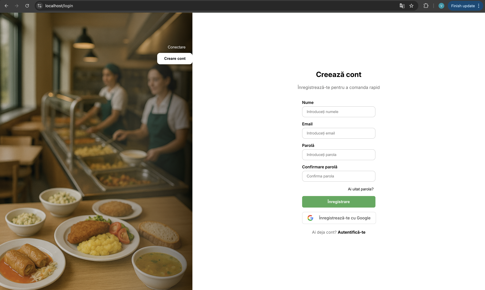
*User registration form for creating a new account.*

---

### 👤 User Dashboard

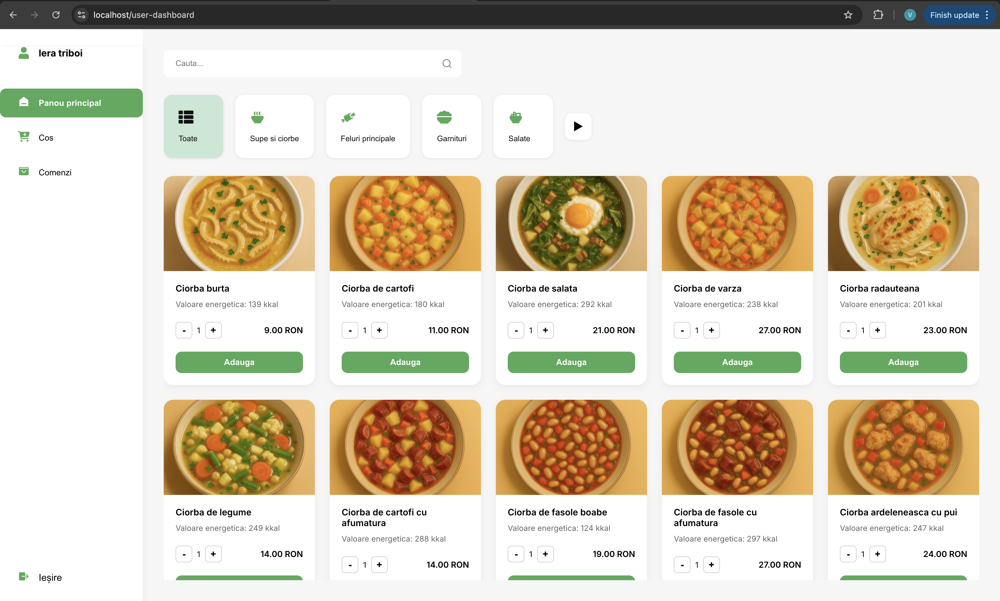
*Main interface where users browse available meals and categories.*

---

### 🛒 Cart & Checkout

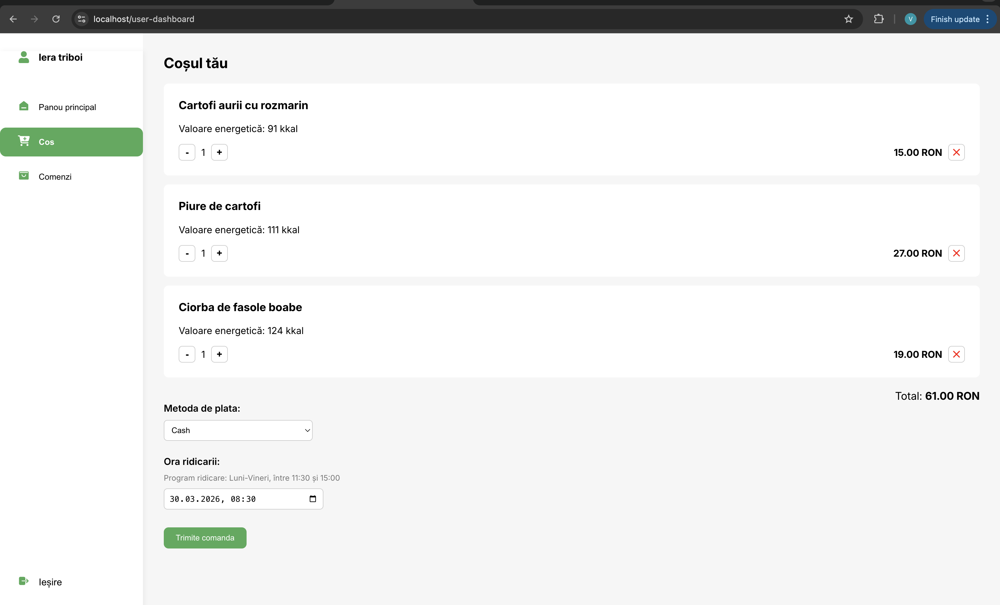
*Shopping cart with selected items and total price calculation.*

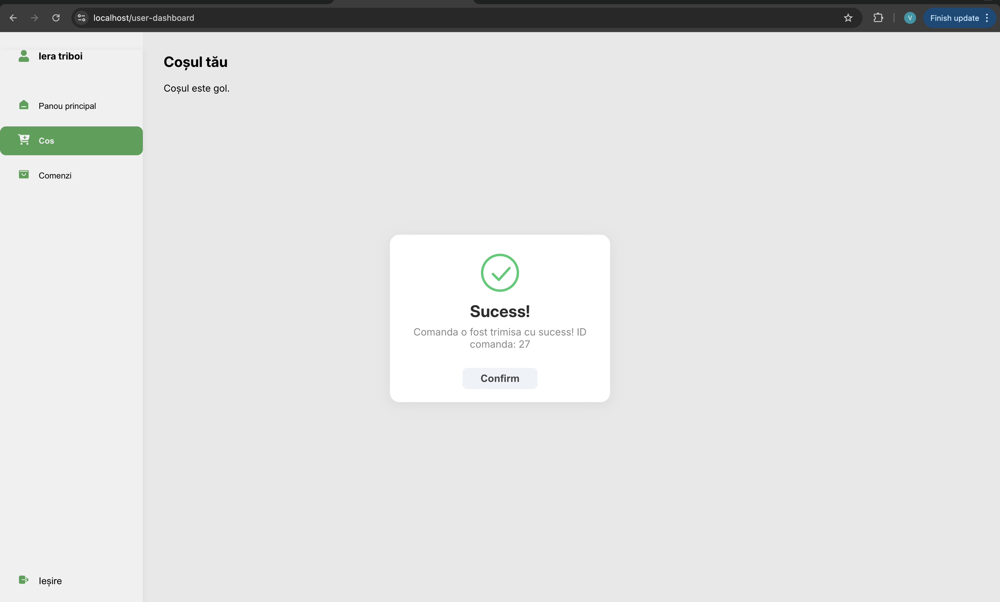
*Confirmation screen after placing an order.*

---

### 📦 Order History

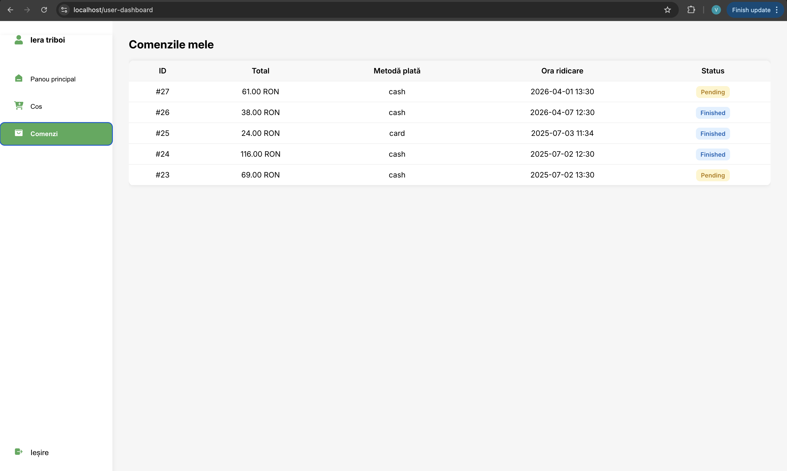
*User order history with status tracking.*

---

### 🧑‍💼 Admin Dashboard

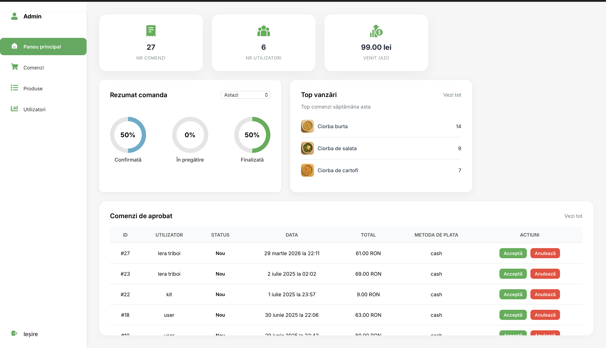
*Overview with real-time statistics.*

---

### 📋 Admin Order Management

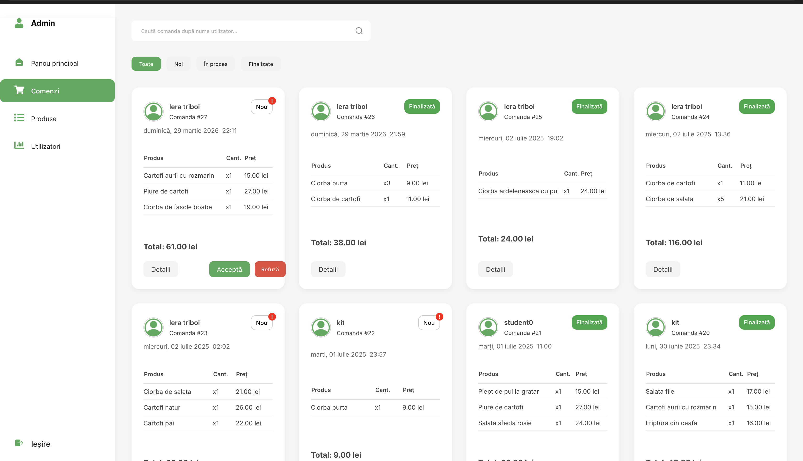
*Manage incoming orders (approve / reject / monitor).*

---

### 🍽️ Admin Product Management

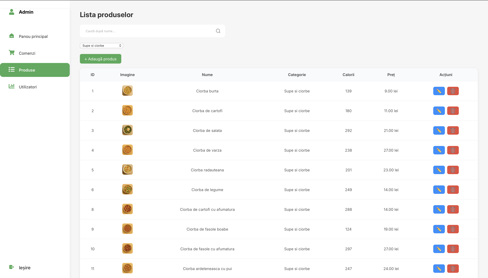
*Manage products (list, filter, edit, delete).*

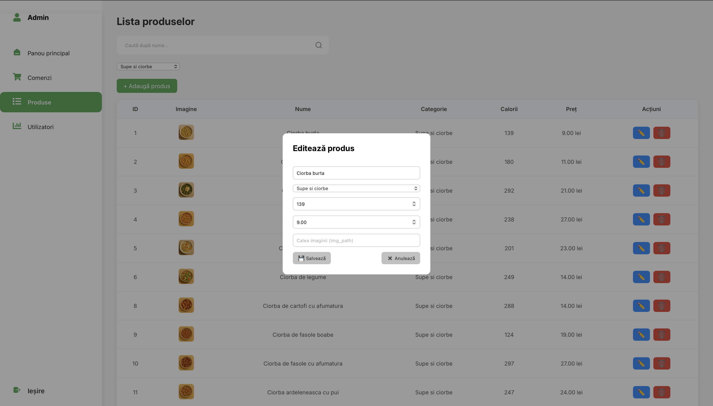
*Update product details.*

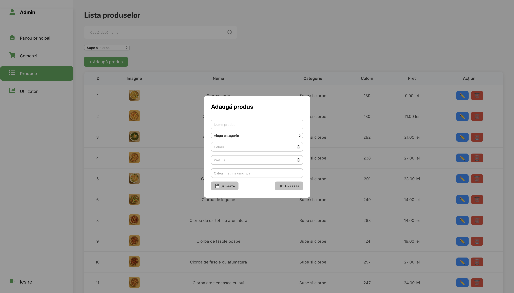
*Add new menu items.*

---

### 👥 Admin User Management

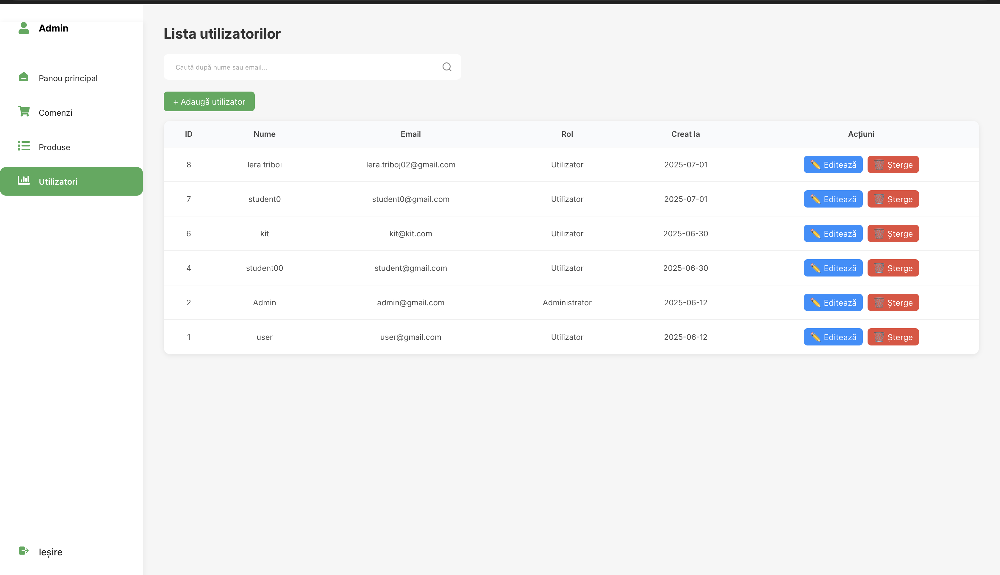
*Full user management system (CRUD).*

---

## ⚙️ Getting Started

### 🐳 Run the full system using Docker

```bash
docker-compose up --build
```

### 🌐 Access

* **Frontend:** http://localhost:3000
* **Backend API:** http://localhost/api

---

## 📈 Engineering Decisions

* **Redis** is used to reduce database load and improve performance
* **Docker** ensures consistent environments and scalability
* **NGINX** acts as a reverse proxy for efficient request handling
* **Modular architecture** enables easier scaling and maintenance

---

## 🎯 Problem Solved

University cafeterias often struggle with:

* long queues
* inefficient order flow
* lack of digital systems

This system:

* reduces waiting time
* improves order organization
* enhances user experience
* supports high-traffic scenarios

---

## 🧠 What I Learned

* Designing scalable full-stack systems
* Working with Docker and containerized environments
* Backend optimization using Redis
* Building real-world admin dashboards
* Structuring scalable applications

---

## 🚀 Future Improvements

* Kafka integration for asynchronous processing
* Real-time notifications (WebSockets)
* Online payments integration
* Mobile application version

---

## 👨‍💻 Author

Developed as a Bachelor's Thesis project with a strong focus on real-world applicability, scalability, and system design.

